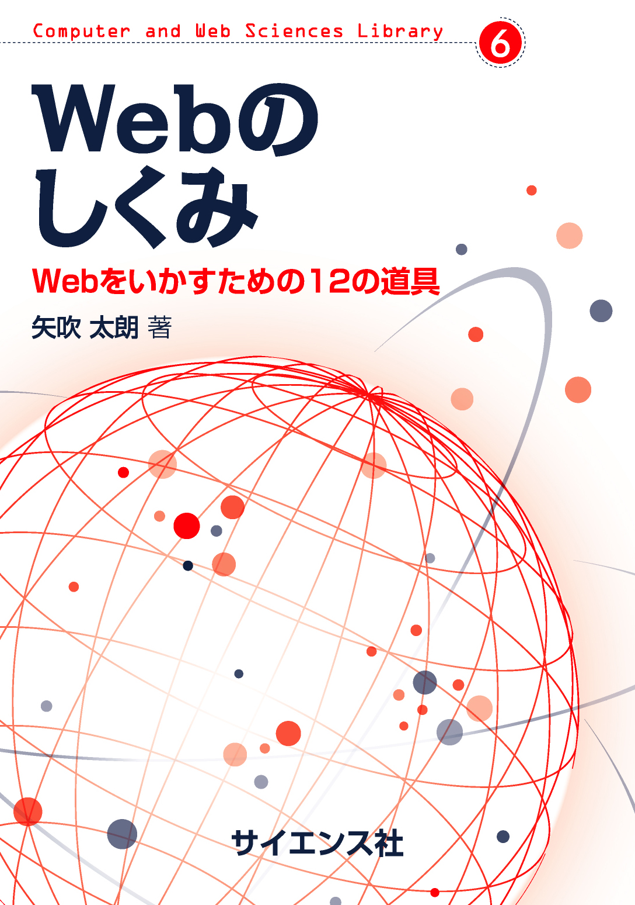

# Webのしくみ（サイエンス社, 2020） サポートサイト

- ISBN: 978-4-7819-1477-0
- サイエンス社
  - [Webのしくみ（本書）](https://www.saiensu.co.jp/search/?isbn=978-4-7819-1477-0&y=2020)
  - [Computer and Web Sciences Library（本書を含むライブラリ）](https://www.saiensu.co.jp/search/?book_class_id=2&library_id=300)

## 図・参考文献・URL

- [はじめに](chapters/preface.md)
- [第0章　この本の読み方](chapters/00.md)
- [第1章　ハイパーメディア](chapters/01.md)
- [第2章　検索](chapters/02.md)
- [第3章　自分のメディア](chapters/03.md)
- [第4章　ライセンス](chapters/04.md)
- [第5章　ソーシャルメディア](chapters/05.md)
- [第6章　アカウント](chapters/06.md)
- [第7章　クラウド（群衆）](chapters/07.md)
- [第8章　暗号](chapters/08.md)
- [第9章　ウェブアプリケーション](chapters/09.md)
- [第10章　データベース](chapters/10.md)
- [第11章　クラウド（雲）](chapters/11.md)
- [第12章　間接参照](chapters/12.md)
- [おわりに](chapters/afterword.md)
- [参考文献](chapters/bibliography.md)

 <a xmlns:cc="http://creativecommons.org/ns#" href="https://github.com/taroyabuki/webbook" property="cc:attributionName" rel="cc:attributionURL">矢吹太朗</a> 作『Webのしくみ（サイエンス社, 2020） サポートサイト』のテキストとSVGは<a rel="license" href="http://creativecommons.org/licenses/by-sa/4.0/">クリエイティブ・コモンズ 表示 - 継承 4.0 国際 ライセンス</a>で提供されています。