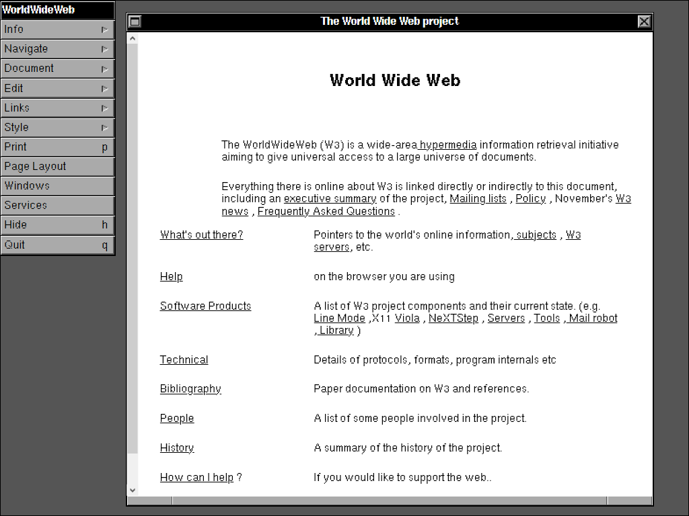
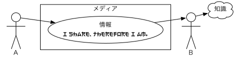

矢吹太朗『Webのしくみ』（サイエンス社, 2020）

# 第0章 この本の読み方

- https://webfoundation.org/2019/03/web-birthday-30/
- https://www.w3.org/History.html
- 
- https://worldwideweb.cern.ch/browser/#http://info.cern.ch/hypertext/WWW//TheProject.html
- 
- https://kotobank.jp/word/情報-79825
- https://onelook.com/?w=information
- https://books.google.com/ngrams