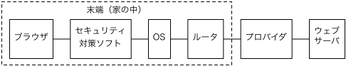

矢吹太朗『Webのしくみ』（サイエンス社, 2020）

# 第1章 ハイパーメディア

## 1.1 ワールドワイドウェブ

- 図1.1 文書の一部（&ldquo;Wikipedia&rdquo;という文字列）から別の文書（本物のウィキペディア）にリンクを張れる． 
- 図1.2 ウェブではできないことの例 
- [ローレンス・レッシグ著, 山形浩生訳. Code Version 2.0. 翔泳社, 第2版, 2007.](https://calil.jp/book/4798115002)，[全文（公開）](https://www.seshop.com/static/images/errata/erimgs/115000/CODE2.0.zip)

## 1.2 URL

- https://ja.wikipedia.org
- [https://ja.wikipedia.org:443/w/index.php?search=湯川秀樹](https://ja.wikipedia.org:443/w/index.php?search=%E6%B9%AF%E5%B7%9D%E7%A7%80%E6%A8%B9)
- [ロイター. WWWの生みの親が語るネットの未来と後悔, 2009.](https://web.archive.org/web/20090320020015/http://www.itmedia.co.jp:80/news/articles/0903/16/news041.html)
- 図1.3 2020年2月15日時点で，ウィキペディア日本語版のページのURLで最長のもの（744文字） [https://ja.wikipedia.org/wiki/%E7%AC%AC6%E5%9B%9EAKB48%E3%82%B0%E3%83%AB%E3%83%BC%E3%83%97_%E3%82%BD%E3%83%AD%E3%82%B7%E3%83%B3%E3%82%B0%E3%83%AB%E4%BA%89%E5%A5%AA%E3%81%98%E3%82%83%E3%82%93%E3%81%91%E3%82%93%E5%A4%A7%E4%BC%9Ain%E6%A8%AA%E6%B5%9C%E3%82%A2%E3%83%AA%E3%83%BC%E3%83%8A%E3%80%9C%E3%81%93%E3%82%93%E3%81%AA%E3%81%A8%E3%81%93%E3%82%8D%E3%81%A7%E3%80%81%E9%81%8B%E3%81%AA%E3%82%93%E3%81%8B%E4%BD%BF%E3%81%A3%E3%81%A1%E3%82%83%E3%81%86%E3%81%AE%E3%81%8B%E3%81%A8%E6%80%9D%E3%81%86%E3%81%8B%E3%82%82%E3%81%97%E3%82%8C%E3%81%AA%E3%81%84%E3%81%8C%E3%80%81%E3%81%A8%E3%82%8A%E3%81%82%E3%81%88%E3%81%9A%E3%80%81%E5%8B%9D%E3%81%9F%E3%81%AA%E3%81%8D%E3%82%83%E3%81%97%E3%82%87%E3%81%86%E3%81%8C%E3%81%AA%E3%81%84%E3%81%A0%E3%82%8D%3F%E3%80%9C](https://ja.wikipedia.org/wiki/%E7%AC%AC6%E5%9B%9EAKB48%E3%82%B0%E3%83%AB%E3%83%BC%E3%83%97_%E3%82%BD%E3%83%AD%E3%82%B7%E3%83%B3%E3%82%B0%E3%83%AB%E4%BA%89%E5%A5%AA%E3%81%98%E3%82%83%E3%82%93%E3%81%91%E3%82%93%E5%A4%A7%E4%BC%9Ain%E6%A8%AA%E6%B5%9C%E3%82%A2%E3%83%AA%E3%83%BC%E3%83%8A%E3%80%9C%E3%81%93%E3%82%93%E3%81%AA%E3%81%A8%E3%81%93%E3%82%8D%E3%81%A7%E3%80%81%E9%81%8B%E3%81%AA%E3%82%93%E3%81%8B%E4%BD%BF%E3%81%A3%E3%81%A1%E3%82%83%E3%81%86%E3%81%AE%E3%81%8B%E3%81%A8%E6%80%9D%E3%81%86%E3%81%8B%E3%82%82%E3%81%97%E3%82%8C%E3%81%AA%E3%81%84%E3%81%8C%E3%80%81%E3%81%A8%E3%82%8A%E3%81%82%E3%81%88%E3%81%9A%E3%80%81%E5%8B%9D%E3%81%9F%E3%81%AA%E3%81%8D%E3%82%83%E3%81%97%E3%82%87%E3%81%86%E3%81%8C%E3%81%AA%E3%81%84%E3%81%A0%E3%82%8D%3F%E3%80%9C)
- [小川進. QRコードの奇跡&mdash;モノづくり集団の発想転換が革新を生んだ. 東洋経済新報社, 2020.](https://calil.jp/book/4492534199)
- 図1.4 ウィキペディアの最も長いURLのQRコード 
- [TinyURL](https://tinyurl.com)
- https://tinyurl.com/w6bxfnv
- https://preview.tinyurl.com/w6bxfnv
- https://bit.ly/bcat-tools+
- [ティム・バーナーズ＝リー著, 神崎正英訳. クールなURIは変わらない.](https://www.kanzaki.com/docs/Style/URI)

## 1.3 ウェブとインターネットの違い

- 図1.5 コンピュータA，B，CでウェブページX，Y，Zが公開されている様子 

## 1.4 ウェブブラウザ

- 図1.6 [Pure CSS Lace](https://diana-adrianne.com/purecss-lace/)
  - (a) Chrome 78.0 
  - (b) Edge 44.1763 
- https://www.whatismybrowser.com

## 1.5 アクセス制限

- [日本国憲法](https://elaws.e-gov.go.jp/document?lawid=321CONSTITUTION_19470503_000000000000000)
- 図1.7 ブラウザとウェブの間にあるもの 
- 図1.8 macOSのペアレンタルコントロールで，アダルトサイトへのアクセスを制限している様子 
- [メアリー・エイケン著, 小林啓倫訳. 子どもがネットに壊される&mdash;いまの科学が証明した子育てへの影響の真実. ダイヤモンド社, 2018.](https://calil.jp/book/4478101965)
