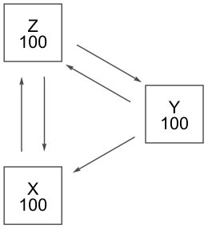
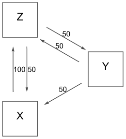
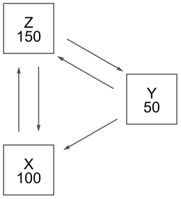
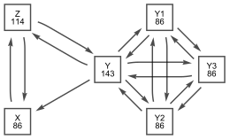
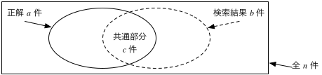

矢吹太朗『Webのしくみ』（サイエンス社, 2020）

# 第2章 検索

## 2.1 検索の基本

- https://www.google.com/advanced_search
- [ピーター・モービル著, 浅野紀予訳. アンビエント・ファインダビリティ&mdash;ウェブ，検索，そしてコミュニケーションをめぐる旅. オライリージャパン, 2006.](https://calil.jp/book/4873112834)
- https://www.nic.ad.jp/ja/dom/types.html

## 2.2 検索すれば何でも見つかる？

- https://support.google.com/websearch/answer/2744324
- https://www.lumendatabase.org/
- https://twitter.com/search-advanced
- [グーグルブックス](https://books.google.co.jp)
- [シヴァ・ヴァイディアナサン著, 久保儀明訳. グーグル化の見えざる代償. インプレス, 2012.](https://calil.jp/book/4844331434)
- [レファレンス協同データベース](https://crd.ndl.go.jp)
- [生命、宇宙、そして万物についての究極の疑問の答え](https://www.google.com/search?q=%E7%94%9F%E5%91%BD%E3%80%81%E5%AE%87%E5%AE%99%E3%80%81%E3%81%9D%E3%81%97%E3%81%A6%E4%B8%87%E7%89%A9%E3%81%AB%E3%81%A4%E3%81%84%E3%81%A6%E3%81%AE%E7%A9%B6%E6%A5%B5%E3%81%AE%E7%96%91%E5%95%8F%E3%81%AE%E7%AD%94%E3%81%88)
- [ダグラス・アダムス著, 風見潤訳. 銀河ヒッチハイク・ガイド. 新潮社, 1982.](https://calil.jp/search?q=%E9%8A%80%E6%B2%B3%E3%83%92%E3%83%83%E3%83%81%E3%83%8F%E3%82%A4%E3%82%AF%E3%83%BB%E3%82%AC%E3%82%A4%E3%83%89)

## 2.3 検索エンジンのしくみ

- 図2.1 ページXがZ，YがXとZ，ZがXとYにリンクしている場合の，ページランクの計算方法
  - (a) 100点持たせる． 
  - (b) リンク先に配る． 
  - (c) 点数を更新する． 
- [ジョン・マコーミック著, 長尾高弘訳. 世界でもっとも強力な9のアルゴリズム. 日経BP, 2012.](https://calil.jp/book/482228493X)
- [WolframAlpha](https://www.wolframalpha.com/input?i=%7B%7B0%2C1%2F2%2C1%2F2%7D%2C%7B0%2C0%2C1%2F2%7D%2C%7B1%2C1%2F2%2C0%7D%7D&lang=ja)

## 2.4 検索についての補足

- [Googleについて](https://about.google)
- 図2.2 指標がページランクだけだとわかれば，図2.1では最下位だったYのページランクを，Y1, Y2, Y3を作ることで上げられる（[Wolfram|Alpha](https://www.wolframalpha.com/input?i=%7B%7B0%2C1%2F5%2C1%2F2%2C0%2C0%2C0%7D%2C%7B0%2C0%2C1%2F2%2C1%2F3%2C1%2F3%2C1%2F3%7D%2C%7B1%2C1%2F5%2C0%2C0%2C0%2C0%7D%2C%7B0%2C1%2F5%2C0%2C0%2C1%2F3%2C1%2F3%7D%2C%7B0%2C1%2F5%2C0%2C1%2F3%2C0%2C1%2F3%7D%2C%7B0%2C1%2F5%2C0%2C1%2F3%2C1%2F3%2C0%7D%7D&lang=ja)）． 
- 図2.3 検索エンジンの性能を考える材料 
- [Bing](https://www.bing.com)
- [Sergey Brin and Lawrence Page. The anatomy of a large-scale hypertextual web search engine. <em>Computer Networks and ISDN Systems</em>, Vol. 30, No. 1&ndash;7, pp. 107&ndash;117, 1998.](http://infolab.stanford.edu/~backrub/google.html)
- [DuckDuckGo](https://duckduckgo.com)
- [グーグルトレンド](https://trends.google.co.jp)
- [図2.4 2016年1月1日から2019年12月31日までに「自民党」（青）と「共産党」（赤）が検索された様子](https://trends.google.co.jp/trends/explore?q=%E8%87%AA%E6%B0%91%E5%85%9A,%E5%85%B1%E7%94%A3%E5%85%9A&geo=JP&date=2016-01-01%202019-12-31)
- [セス・スティーヴンズ＝ダヴィドウィッツ著, 酒井泰介訳. 誰もが嘘をついている&mdash;ビッグデータ分析が暴く人間のヤバい本性. 光文社, 2018.](https://calil.jp/book/4334962165)
