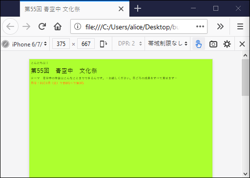
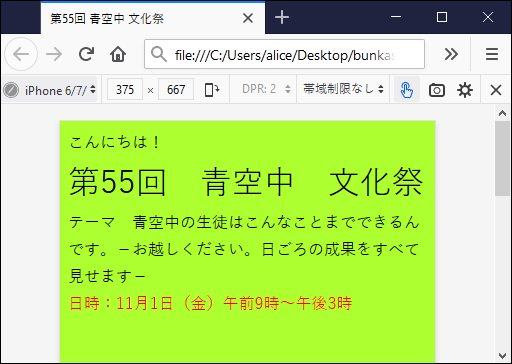

矢吹太朗『Webのしくみ』（サイエンス社, 2020）

# 第3章 自分のメディア

## 3.1 情報発信

## 3.2 「ウェブページ」と「ホームページ」

- https://www.w3.org
- 

## 3.3 コンテンツの形式

- [](https://taroyabuki.github.io/webbook/link.html)
- 
- 
- [とほほのWWW入門](http://www.tohoho-web.com/www.htm)
- https://developer.mozilla.org/ja/docs/Web/HTML
- [図3.4](https://taroyabuki.github.io/webbook/circles.html)
- 
- [グーグルマップ](https://www.google.co.jp/maps)
- [図3.6(a)](https://taroyabuki.github.io/webbook/alert.html)
- [アラートループ（無限アラート）](https://taroyabuki.github.io/webbook/alert-loop.html)
- [図3.6(b)](https://taroyabuki.github.io/webbook/event.html)
- [図3.6(b) 簡潔版](https://taroyabuki.github.io/webbook/event2.html)

## 3.4 情報発信の形式

- [Andrew Kirkpatrick, Joshue O Connor, Alastair Campbell, MichaelCooper編, ウェブアクセシビリティ基盤委員会翻訳ワーキンググループ訳. Web content accessibility guidelines (WCAG) 2.1, 2018.](https://waic.jp/docs/WCAG21/)
- [気象庁](https://www.data.jma.go.jp/obd/stats/etrn/)
- [WolframAlpha](https://www.wolframalpha.com/input/?i=tokyo+temperature+from+2016%2F5%2F23+to+2016%2F5%2F29&lang=ja)
- [表3.7](https://taroyabuki.github.io/webbook/temperature.html)
- [図3.7(a)](figures/temperature.csv)
- 
- [](https://taroyabuki.github.io/webbook/bunkasai5.html)
- [](https://taroyabuki.github.io/webbook/bunkasai5-viewport.html)

## 3.5 HTML文書の正しさ

表3.8についての補足

表示と意味のどちらも正しい例：

```html
<ol>
<li>ホップ</li>
<li>ステップ</li>
<li>ジャンプ</li>
</ol>
```

表示は正しいが意味は正しくない例：

```html
1. ホップ<br/>
2. ステップ<br/>
3. ジャンプ<br/>
```

- https://www.w3.org/DesignIssues/Principles.html\#Tolerance
- [Markup Validation Service](https://validator.w3.org)
- [表3.9](../docs/bunkasai.html)
- [表3.10](https://validator.w3.org/nu/?doc=https%3A%2F%2Ftaroyabuki.github.io%2Fwebbook%2Fbunkasai.html)
