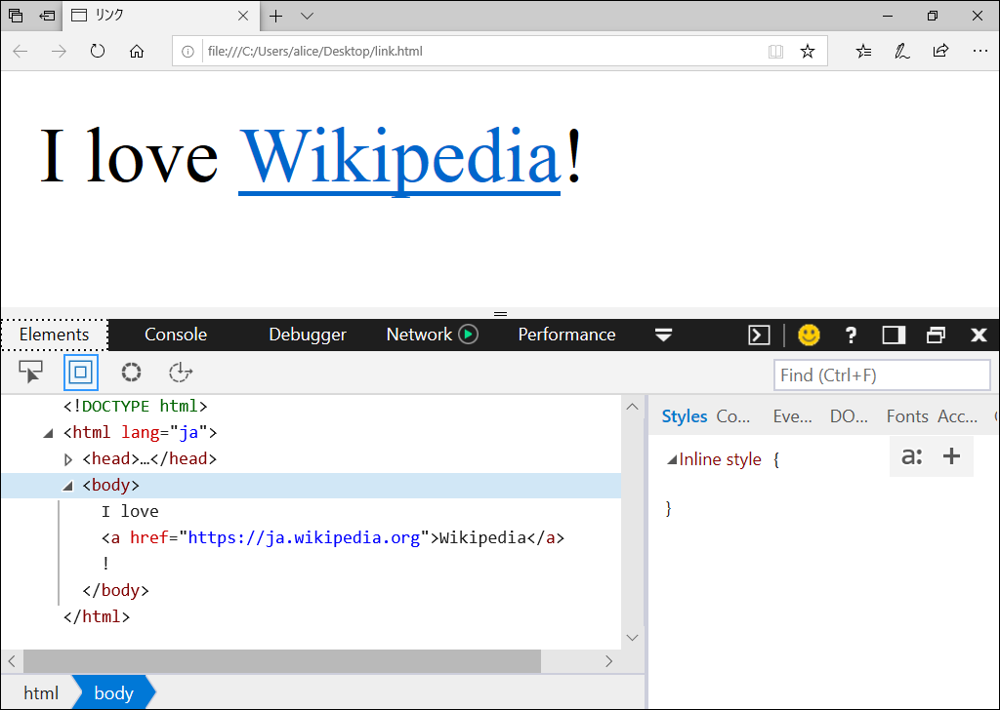
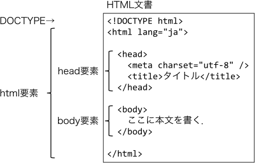
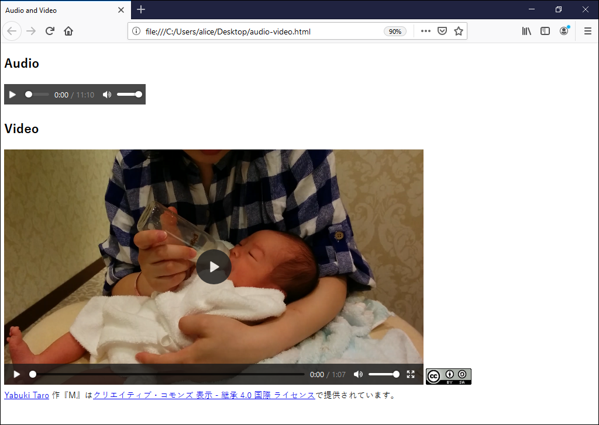
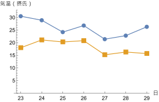

矢吹太朗『Webのしくみ』（サイエンス社, 2020）

# 第3章 自分のメディア

## 3.1 情報発信

## 3.2 「ウェブページ」と「ホームページ」

- https://www.w3.org
- 図3.1 筆者のFirefoxの設定画面<br>

## 3.3 コンテンツの形式

- [図3.2 閲覧しているウェブページ（上）と，そのHTML（左下）<br>](https://taroyabuki.github.io/webbook/link.html)
- 
- 図3.3 HTML文書の枠組み<br>
- HTMLのリファレンス
  - [とほほのWWW入門](http://www.tohoho-web.com/www.htm)
  - https://developer.mozilla.org/ja/docs/Web/HTML
- [図3.4 ラスタ形式の円（左）とベクタ形式の円（右）](https://taroyabuki.github.io/webbook/circles.html)
- 図3.5 本文掲載のaudio要素とvideo要素を含むページをブラウザで表示させた結果 
- [グーグルマップ](https://www.google.co.jp/maps)
- 図3.6 ウェブページ上で動くプログラムの例
  - [(a) ダイアログボックス](https://taroyabuki.github.io/webbook/alert.html)
  - [(b) 文字列の変換](https://taroyabuki.github.io/webbook/event.html)
  - [(b) 文字列の変換（簡潔版）](https://taroyabuki.github.io/webbook/event2.html)
- [アラートループ（無限アラート）](https://taroyabuki.github.io/webbook/alert-loop.html)

## 3.4 情報発信の形式

- [Andrew Kirkpatrick, Joshue O Connor, Alastair Campbell, MichaelCooper編, ウェブアクセシビリティ基盤委員会翻訳ワーキンググループ訳. Web content accessibility guidelines (WCAG) 2.1, 2018.](https://waic.jp/docs/WCAG21/)
- [気象庁](https://www.data.jma.go.jp/obd/stats/etrn/)
- [WolframAlpha](https://www.wolframalpha.com/input/?i=tokyo+temperature+from+2016%2F5%2F23+to+2016%2F5%2F29&lang=ja)
- [表3.7 2016年5月23日から29日の東京の気温（摂氏）](https://taroyabuki.github.io/webbook/temperature.html)
- 図3.7 基本の変化の表現形式
  - [(a) CSV形式](figures/temperature.csv)
  - (b) 折れ線グラフ<br>
- 図3.8 スマートフォンでの見え方をシミュレートしている様子
  - [(a) viewport 設定なし 
  - [(b) viewport 設定あり 

## 3.5 HTML文書の正しさ

表3.8 HTML文書の正しさの観点

観点|判定すべきこと
--|--
構文|マークアップがHTMLの規格どおりかどうか
意味|マークアップの意味が作成者の意図どおりかどうか
表示|ページの表示が作成者の意図どおりかどうか
内容|ページの内容が正しいかどうか


補足

- 構文のチェックは機械的にできる．
- 表示と意味のどちらも正しい例：
```html
<ol>
<li>ホップ</li>
<li>ステップ</li>
<li>ジャンプ</li>
</ol>
```

- 表示は正しいが意味は正しくない例（回避には知識が必要）：

```html
1. ホップ<br>
2. ステップ<br>
3. ジャンプ<br>
```

- https://www.w3.org/DesignIssues/Principles.html\#Tolerance
- [Markup Validation Service](https://validator.w3.org)
- [表3.9 まちがいを含んだHTML文書](../docs/bunkasai.html)
- [表3.10 表3.9のHTMLに対するエラーと警告（エラーは警告より深刻）](https://validator.w3.org/nu/?doc=https%3A%2F%2Ftaroyabuki.github.io%2Fwebbook%2Fbunkasai.html)
