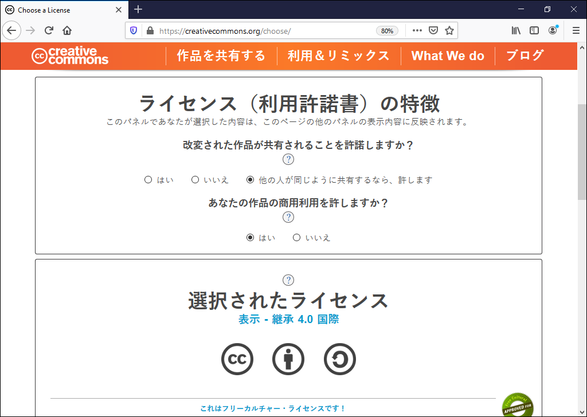
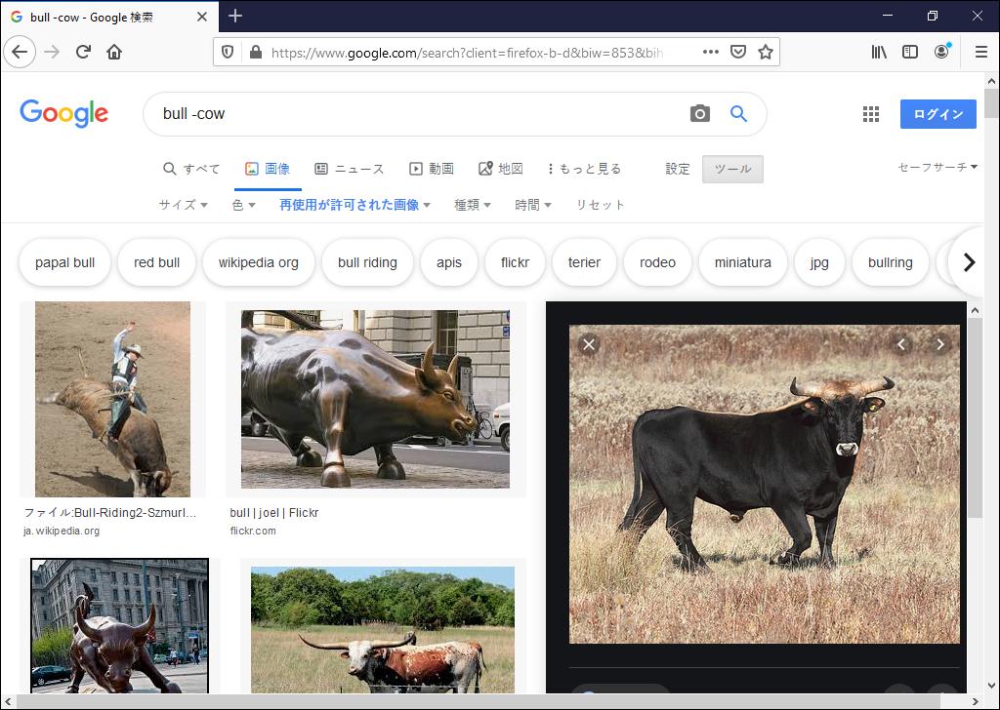

矢吹太朗『Webのしくみ』（サイエンス社, 2020）

# 第4章 ライセンス

- [リチャード・ストールマン著, 長尾高弘訳. フリーソフトウェアと自由な社会&mdash;Richard M. Stallmanエッセイ集. アスキー, 2003.](https://calil.jp/book/4756142818)

## 4.1 ウェブの発展の一因

## 4.2 著作権

- [著作権法](https://elaws.e-gov.go.jp/search/elawsSearch/elaws_search/lsg0500/detail?lawId=345AC0000000048)
- [ローレンス・レッシグ著, 山形浩生訳. コモンズ&mdash;ネット上の所有権強化は技術革新を殺す. 翔泳社, 2002.](https://calil.jp/book/4798102040)
- [文化庁. 著作権テキスト.](https://www.bunka.go.jp/seisaku/chosakuken/seidokaisetsu/kyozai.html)
- [福井健策「ミッキーマウスの著作権保護期間～史上最大キャラクターの日本での保護は2020年5月で終わるのか。2052年まで続くのか～」](https://www.kottolaw.com/column/190913.html)

## 4.3 ライセンス付きの情報発信

- [図4.1 クリエイティブコモンズのライセンスを選ぶ ](https://creativecommons.org/choose/)
- 図4.2 「再利用が許可された画像」という条件で雄牛（bull）を，雌牛（cow）を除外しながら検索している様子
- 図4.3 「hello, world」と表示するプログラム（C言語）
  - [C言語](figures/hello.c)
  - [実行形式のバイト列](figures/dump.txt)
- [フリーソフトウェア財団著, 情報処理推進機構訳. GNU一般公衆利用許諾書, 2007.](https://www.ipa.go.jp/files/000028332.html)
- [Kyle E.Mitchell著, POSTD訳. MITライセンスを1行1行読んでいく, 2016.](https://postd.cc/mit-license-line-by-line/)
- [https://ja.wikipedia.org/wiki/オープンソースの定義](https://ja.wikipedia.org/wiki/%E3%82%AA%E3%83%BC%E3%83%97%E3%83%B3%E3%82%BD%E3%83%BC%E3%82%B9%E3%81%AE%E5%AE%9A%E7%BE%A9)
- [https://www.google.com/search?q=トンプソン・ハック](https://www.google.com/search?q=%E3%83%88%E3%83%B3%E3%83%97%E3%82%BD%E3%83%B3%E3%83%BB%E3%83%8F%E3%83%83%E3%82%AF)
- [赤攝也ほか訳『ACMチューリング賞講演集』（共立出版, 1989）](https://calil.jp/book/4320024877)
