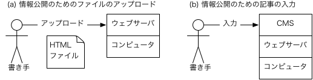
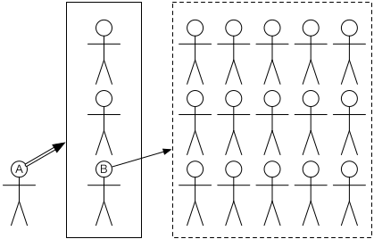

矢吹太朗『Webのしくみ』（サイエンス社, 2020）

# 第5章 シェア

- [カル・ニューポート著, 池田真紀子訳. デジタル・ミニマリスト&mdash;本当に大切なことに集中する. 早川書房, 2019.](https://calil.jp/book/4152098872)

## 5.1 ブログ

- 図5.1 情報公開のために必要な作業 
- 図5.2 WordPressでブログの記事を書いている様子 
- [スコット・ローゼンバーグ著, 井口耕二訳. ブログ誕生&mdash;総表現社会を切り拓いてきた人々とメディア. NTT出版, 2010.](https://calil.jp/book/4757102860)
- [プロバイダ責任制限法](https://elaws.e-gov.go.jp/search/elawsSearch/elaws_search/lsg0500/detail?lawId=413AC0000000137)
- 追記：[アップル、中国App StoreからRSSリーダーを「違法」として削除。当局が金盾回避を嫌った？](https://japanese.engadget.com/apple-china-rssreader-ban-080040600.html)

## 5.2 ソーシャルメディア

- [Twitter](https://twitter.com)
- [Facebook](https://www.facebook.com)
- ツイッターとフェイスブックのユーザのつながり方の違い
  - (a) ツイッター 
  - (b) フェイスブック 
- 追記：[トランプ米大統領はツイッターでブロック禁止＝ニューヨーク連邦地裁](https://www.bbc.com/japanese/44234656)
- 追記：[河野太郎氏「堂々とブロックします」　ネット番組で宣言](https://www.asahi.com/articles/ASP9L6W76P9LULEI006.html)

## 5.3 ソーシャルメディアについての補足

- 図5.4 Aのツイートがリツイートされていく様子 
- [デイヴィッド・パトリカラコス著, 江口泰子訳. 140字の戦争&mdash;SNSが戦場を変えた. 早川書房, 2019.](https://calil.jp/book/4152098627)
- [図5.5 OSINTのためのツール](https://bitly.com/bcat-tools)
- [ジョン・ロンソン著, 夏目大訳. ルポ ネットリンチで人生を壊された人たち. 光文社, 2017.](https://calil.jp/book/4334039723)
- [Soroush Vosoughi et al. The spread of true and false news online. <em>Science</em>, Vol. 359, pp. 1146&ndash;1151, 03 2018.](http://ide.mit.edu/sites/default/files/publications/2017%20IDE%20Research%20Brief%20False%20News.pdf)
- [キャリコネニュース. クラウドソーシングで保守系コメントの書き込み発注，1件30円　「テレビや新聞の偏向報道が許せない方」に依頼. BLOGOS. 2017.](https://blogos.com/article/248533/)
- [一田和樹. フェイクニュース&mdash;新しい戦略的戦争兵器. KADOKAWA, 2018.](https://calil.jp/book/4040822447)
- [Nicky Case. 群衆の英知もしくは狂気.](https://ncase.me/crowds/ja.html)
- [イーライ・パリサー著, 井口耕二訳. 閉じこもるインターネット&mdash;グーグル・パーソナライズ・民主主義. 早川書房, 2012.](https://calil.jp/search?q=%E9%96%89%E3%81%98%E3%81%93%E3%82%82%E3%82%8B%E3%82%A4%E3%83%B3%E3%82%BF%E3%83%BC%E3%83%8D%E3%83%83%E3%83%88)
- [キャス・サンスティーン著, 石川幸憲訳. インターネットは民主主義の敵か. 毎日新聞社, 2003.](https://calil.jp/book/4620316601)
- [デイヴィッド・サンプター著, 千葉敏生・橋本篤史訳. 数学者が検証！ アルゴリズムはどれほど人を支配しているのか？ 光文社, 2019.](https://calil.jp/book/4334962289)
- 追記：[野党攻撃ツイッター「Dappi」が自民党と取引⁉　正体はIT企業　ネット工作まん延か](https://www.tokyo-np.co.jp/article/136538)

## 練習問題

- [2017年8月16日の時点で，史上最も「いいね」を集めたと言われるツイート](https://twitter.com/Twitter/status/897679617821089793)
