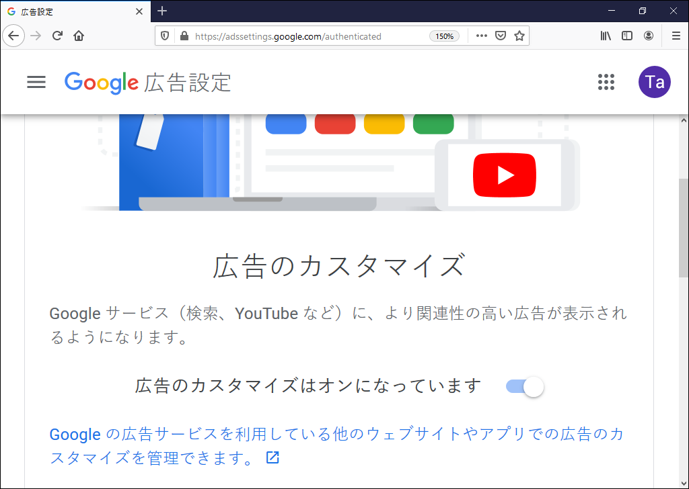
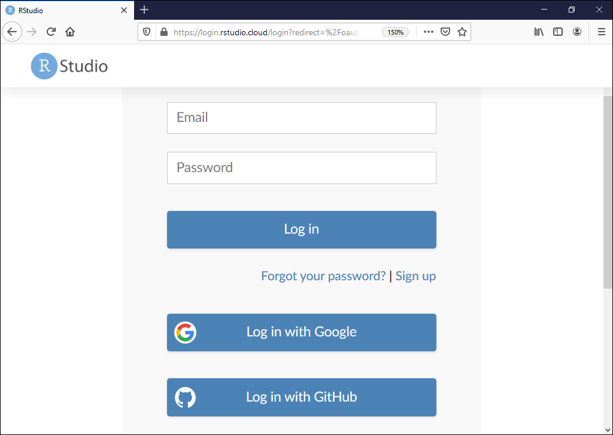

矢吹太朗『Webのしくみ』（サイエンス社, 2020）

# 第6章 アカウント

- [ドストエフスキー著，米川正夫訳『地下生活者の手記』（青空文庫）](https://www.aozora.gr.jp/cards/000363/card57393.html)

## 6.1 ログイン

- 図6.1 ウェブページにAとBが2回ずつアクセスする様子 
- 図6.2 クッキーを使ったセッション管理 
- 図6.3 ソーシャルメディアと無関係なブログを読んでいることが，ソーシャルメディアの運営元に伝わるしくみ 

## 6.2 個人情報

- [公正情報取り扱い綱領](https://aspe.hhs.gov/report/records-computers-and-rights-citizens)
- [ブルース・シュナイアー著, 池村千秋訳. 超監視社会&mdash;私たちのデータはどこまで見られているのか？ 草思社, 2016.](https://calil.jp/book/4794222378)
- [図6.4 グーグルの広告のカスタマイズの設定ページ ](https://adssettings.google.com/authenticated)

## 6.3 認証と認可

- [図6.5 RStudio Cloud のログイン画面 ](https://client.login.rstudio.cloud/oauth/login?show_auth=0&show_login=1&show_setup=1)
- [GitHub](https://github.com)
- 図6.6 サードパーティーのソフトウェアにツイッターで読み書きをする権限を与えようとしている様子 
- 図6.7 ツイッターの管理画面でサードパーティーのサービスやソフトウェアを確認している様子 
