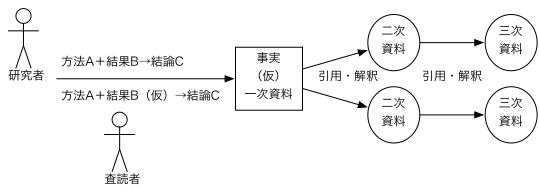

矢吹太朗『Webのしくみ』（サイエンス社, 2020）

# 第7章 クラウド（群衆）

- [図7.1(a)](https://www.istockphoto.com/jp/%E3%82%B9%E3%83%88%E3%83%83%E3%82%AF%E3%83%95%E3%82%A9%E3%83%88/%E3%82%B8%E3%82%A7%E3%83%AA%E3%83%BC%E8%B1%86%E3%82%92%E3%82%AD%E3%83%A3%E3%83%B3%E3%83%87%E3%82%A3%E3%82%AC%E3%83%A9%E3%82%B9%E3%81%AE%E7%93%B6%E5%85%A5%E3%82%8A-gm177092657-19741884)
-  https://commons.wikimedia.org/wiki/File:Taurus_bull_MBD.jpg by Magret Bunzel-Drüke [[CC BY-SA 3.0](https://creativecommons.org/licenses/by-sa/3.0)], via Wikimedia Commons.
- https://www.openstreetmap.org
- https://www.aozora.gr.jp
- https://www.gutenberg.org
- https://en.wikipedia.org/wiki/Wikipedia:Size_in_volumes
- [https://ja.wikipedia.org/w/index.php?title=ブラックホール&oldid=75488737](https://ja.wikipedia.org/w/index.php?title=%E3%83%96%E3%83%A9%E3%83%83%E3%82%AF%E3%83%9B%E3%83%BC%E3%83%AB&oldid=75488737)
- 
- https://ja.wikipedia.org/wiki/Wikipedia:%E5%85%8D%E8%B2%AC%E4%BA%8B%E9%A0%85
