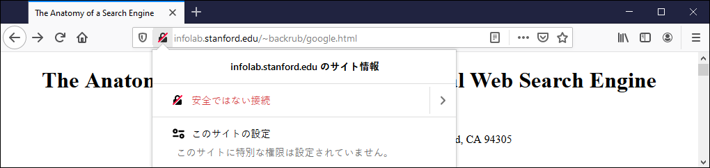
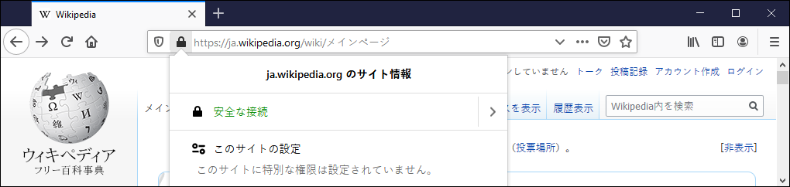
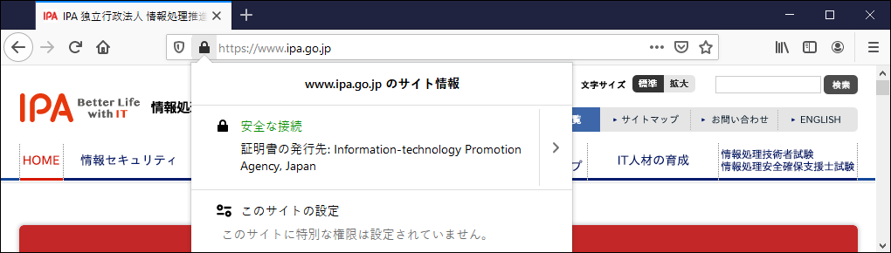
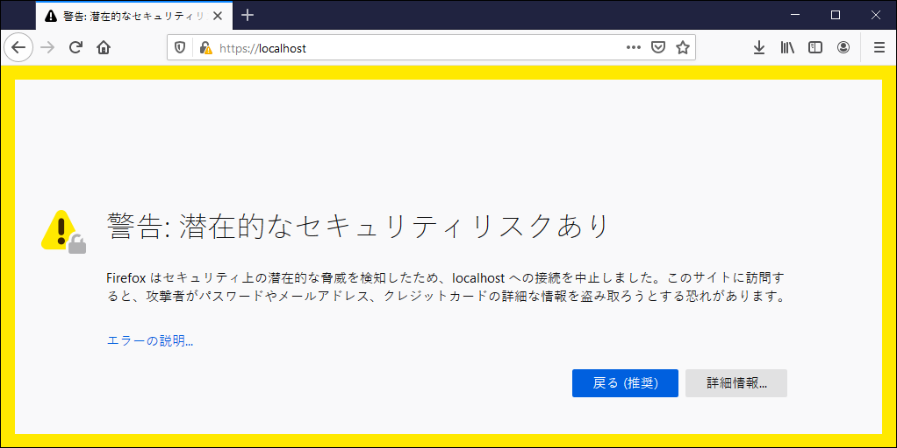

矢吹太朗『Webのしくみ』（サイエンス社, 2020）

# 第8章 暗号

- [ブルース・シュナイアー著, 池村千秋訳. 超監視社会&mdash;私たちのデータはどこまで見られているのか？ 草思社, 2016.](https://calil.jp/book/4794222378)

## 8.1 事後否認・改ざん・なりすまし・盗聴

## 8.2 暗号の基本

- 図8.1 シーザー暗号（「+13」文字ずらす）を使って，アリスがボブにメッセージを送っている様子 
- [WolframAlphaで「`rot13 hello`」](https://www.wolframalpha.com/input/?i=rot13+hello&lang=ja)
- 補足：https://rot13.com

## 8.3 公開鍵暗号

- [結城浩. 暗号技術入門&mdash;秘密の国のアリス. SBクリエイティブ, 第3版, 2015.](https://calil.jp/book/4797382228)
- [スコット・アーロンソン著, 森弘之訳. デモクリトスと量子計算. 森北出版, 2020.](https://calil.jp/book/4627872011)
- 図8.2 公開鍵暗号を使った暗号化と復号 
- 図8.3 RSA暗号の特徴の一つ：秘密鍵で「暗号化」し，公開鍵で復号することもできる． 
- [WolframAlphaで「`MD5 HELLO`」](https://www.wolframalpha.com/input/?i=MD5+HELLO&lang=ja)
- [グレン・グリーンウォルド著, 田口俊樹ほか訳. 暴露&mdash;スノーデンが私に託したファイル. 新潮社, 2014.](https://calil.jp/book/4105066919)

## 8.4 ウェブの安全性

- 図8.4 スキームをブラウザ（Firefox 74.0.1）で確認している様子
  - [(a) httpで公開されている論文10)（2020年4月） ](http://infolab.stanford.edu/~backrub/google.html)
  - [(b) ウィキペディアはhttps．錠のクリックで「安全な接続」の表示 ](https://ja.wikipedia.org)
  - [(c) IPAはhttps．錠のクリックで「証明書の発行先」の表示 ](https://www.ipa.go.jp)
- [不正アクセス禁止法](https://elaws.e-gov.go.jp/search/elawsSearch/elaws_search/lsg0500/detail?lawId=411AC0000000128)
- 図8.5 有効なデジタル証明書を確認できない場合に出る警告（Firefox 74.0.1の場合）
- Tor
  - Torでのアクセスを提供するサービスの例
    - [BBC（英国放送協会）](https://www.bbcnewsv2vjtpsuy.onion)
    - [ニューヨークタイムズ](https://www.nytimes3xbfgragh.onion)
  - Torのためのソフトウェアの例
    - [Tor Browser](https://www.torproject.org)（ブラウザ）
    - [Qubes OS](https://www.qubes-os.org)（OS）
    - [Tails](https://tails.boum.org)（OS）
    - 補足：[Brabe](https://brave.com)（ブラウザ）
  - [コリイ・ドクトロウ著, 金子浩訳. リトル・ブラザー. 早川書房, 2011.](https://calil.jp/book/4152091991)
