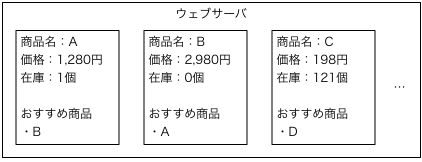
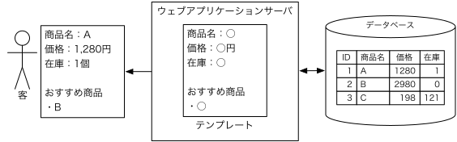

矢吹太朗『Webのしくみ』（サイエンス社, 2020）

# 第10章 データベース

## 10.1 なぜデータベースが必要か

- 図10.1 商品ごとに静的なページがあるショッピングサイト 
- 図10.2 データベースを利用するショッピングサイト 

## 10.2 データベースの設計

## 10.3 データベース管理システム

- [MySQL](https://www.mysql.com/jp/)
- [PostgreSQL](https://www.postgresql.org)
- [SQLite](https://www.sqlite.org)

## 10.4 データベースのための言語

- 補足：[SQLの実践のための資料](10.4/sql.ipynb)　文書が表示されない場合→[Google Colabで開く](https://colab.research.google.com/github/taroyabuki/webbook/blob/master/chapters/10.4/sql.ipynb)
- 補足：[郵便番号データベースによる体験SQL](10.4/zip.ipynb)　文書が表示されない場合→[Google Colabで開く](https://colab.research.google.com/github/taroyabuki/webbook/blob/master/chapters/10.4/zip.ipynb)
