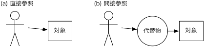

矢吹太朗『Webのしくみ』（サイエンス社, 2020）

# 第12章 間接参照

- [ディオミディス・スピネリス. もう一段の間接参照. アンディ・オラム, グレッグ・ウィルソン（編）, ビューティフルコード. オライリー・ジャパン, 2008.](https://calil.jp/book/4873113636)

<blockquote class="twitter-tweet">
「間接参照」についての，講義資料動画．  拙著『Webのしくみ』（サイエンス社, 2020）では，もう少し一般向けの例を紹介しているのですが． <a href="https://t.co/jyxuvQ6qGI">pic.twitter.com/jyxuvQ6qGI</a>
&mdash; Taro Yabuki (@yabuki) <a href="https://twitter.com/yabuki/status/1341300432841265154?ref_src=twsrc%5Etfw">December 22, 2020</a></blockquote> 

## 12.1 SNS

## 12.2 文字コード

- 図12.1 直接参照と間接参照 
- [表12.1 ASCII （灰色部分は制御文字，それ以外は印刷可能文字）](https://taroyabuki.github.io/webbook/ascii.html)
- [常用漢字表, 2010.](https://www.bunka.go.jp/kokugo_nihongo/sisaku/joho/joho/kijun/naikaku/kanji/)
- [文化審議会国語分科会「常用漢字表の字体・字形に関する指針（報告） 概要](https://www.bunka.go.jp/koho_hodo_oshirase/hodohappyo/pdf/2016022902_besshi01.pdf)
- [Unicode Character Code Charts](https://unicode.org/charts/)
- https://unicode.org/Public/
- [ユニコードの漢字のデータベース](https://unicode.org/charts/unihan.html)
- [表12.2 ユニコードに収録された文字の例](https://taroyabuki.github.io/webbook/unicode.html)
- [文字実体参照](https://dev.w3.org/html5/html-author/charref)
- [表12.4 ASCII文字のURLでの記述方法](https://taroyabuki.github.io/webbook/ascii.html)
- https://ja.wikipedia.org/wiki/%E6%83%85%E5%A0%B1
- [RFC 3986](https://www.ietf.org/rfc/rfc3986.txt)
- [表12.5 font-familyプロパティ値の例](https://taroyabuki.github.io/webbook/font.html)
- [Google Fonts](https://fonts.google.com)
